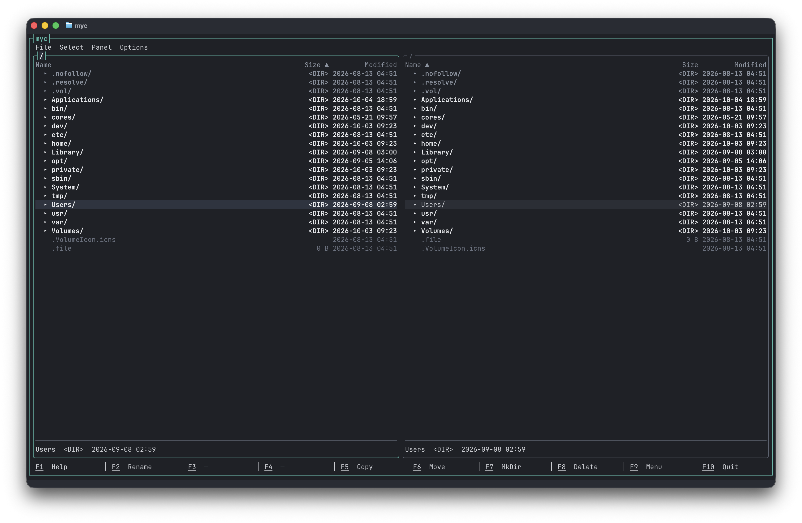

# myc — My Commander

myc is My Commander, a dual-panel file manager for the macOS terminal. It keeps the Norton Commander screen — a directory on the left, a directory on the right, and a function-key bar along the bottom — and it is simpler than Midnight Commander, on purpose. The command line is crowded again. myc is the companion that just moves the files.



Graphite, the default theme. The bright border is the panel that has the keyboard.

- **Layout.** Two panels. Tab switches. You see the destination before you copy.
- **Keys.** F5 copies, F6 moves, F8 sends the selection to Trash.
- **Manners.** Clear dialogs, a short menu, and the screen restored when you quit.


## The layout that stuck

Norton Commander made the job obvious in 1986: look at both places, mark what you need, and act. That picture has not been improved on. Midnight Commander carried it forward and kept adding. myc stops at the picture.

**1986 · Norton Commander.** The original. Two panels, ten function keys, blue and yellow. F5 copied, F8 deleted, Tab changed sides. The habits are still in people’s hands.

**1994 · Midnight Commander.** The portable descendant, and a large one: a shell, a viewer, an editor, archives, FTP, and a user menu you can script. Capable, and a lot to carry.

**Today · myc.** The same two panels and the same keys. Four short menus — File, Select, Panel, Options — and dialogs that say what they will do. No shell inside the file manager.

F5 still copies. F6 moves. F8 deletes. Tab still changes sides.

## Where it shines

The point of a smaller commander is that the everyday moves stay fast, and the dangerous ones stay obvious.

**Both directories, on screen.** Copy and move go to the other panel, so you are looking at the destination when you confirm. `Alt+=` shows the current folder on the other side. `Ctrl+U` swaps the two. The active panel wears the brighter border.

**Mark, then act.** Space marks the row under the cursor. `+` selects a pattern such as `*.jpg` and counts the matches as you type; `-` clears that pattern. With nothing marked, the command uses the cursor.

**Trash, unless you insist.** F8 moves the selection to the macOS Trash. `Shift+F8` deletes permanently, and it asks more firmly. Esc leaves a dialog without taking the action. If a copy or a delete is already running, Esc cancels it.

**A good guest in the terminal.** Graphite is the default: dark, neutral, teal only where it means something. Paper is the light theme. Set `NO_COLOR` and myc keeps the terminal’s own colours — marks stay a glyph, not only a tint. Quit, and the screen is put back.

## A small program for a busy terminal

Claude Code, Codex, Pi, and GitHub Copilot have made the terminal a place people stay. They write, they run, they range across a repository. Comparing two directories, and moving a marked set of files, is still a file manager’s job.

myc is the companion for that moment. Open it in the same window, do the file work, and leave with F10 or `Ctrl+Q`. The agent keeps the session. You keep the Norton keys.

## The bar is the interface

F9 opens the menu, and every item shows its shortcut, so the menu is also the cheat sheet. There is no separate Left and Right menu. Panel means the panel you are in.


| F1   | F2     | F3  | F4  | F5   | F6   | F7    | F8     | F9   | F10  |
| ---- | ------ | --- | --- | ---- | ---- | ----- | ------ | ---- | ---- |
| Help | Rename | —   | —   | Copy | Move | MkDir | Delete | Menu | Quit |


F3 and F4 stay on the bar, dimmed, until a viewer and an editor exist. The row does not grow a hole in the meantime. On a Mac, Esc then a digit does the same as the function key.

## Run

The command is `myc`. The first launch opens the current directory on the left and your home folder on the right. Later launches reopen the folders you left, unless `~/.config/myc/settings.json` says `"startup": "default"`. Config lives in `~/.config/myc/`. The plan is in [plan/](plan/README.md).

```bash
dotnet test src/Myc.sln
dotnet run --project src/Myc.App
```


## In use

`Tab` switches panels. `→` or `Enter` opens a directory, `←` returns to it, and `Enter` on a file opens it. `F2` renames the cursor item. `F5` copies the selection to the other panel and `F6` moves it. `F7` creates a folder (`a/b/c` creates the missing parents); when items are marked it can move them into that folder. `F8` moves the selection to Trash. `Shift+F8` deletes it permanently and always asks first. `Ctrl+O` reveals the cursor item in Finder; on `..` it reveals the folder the panel is showing. `F1` shows the key reference. `F9` opens the menu (File, Select, Panel, Options). Options → Confirm before turns the Trash, overwrite, and copy/move questions on or off, and that choice is remembered. Copy/Move starts off, so `F5` and `F6` use the other panel without a path dialog until that box is ticked. Options → About, and Open settings file opens `~/.config/myc/settings.json`. `Ctrl+F3` through `Ctrl+F6` sort the active panel by name, extension, size, or modified, and the same key again reverses it. The heading shows `▲` or `▼`. `+` marks names matching a pattern (`*.jpg`) and `-` unmarks them. The dialog shows how many match as you type. `*` swaps the marks and `Ctrl+A` marks everything except `..`. `Ctrl+G` opens a path in the active panel (`~` is home, Tab completes the last name, Up and Down recall a path). `Alt+=` shows that folder in the other panel and `Ctrl+U` swaps the two panels. `Alt+.` hides or shows hidden files. A panel reloads on its own when another program changes that folder. `F9` → Options → Theme… lists Graphite (the default), Paper, and Terminal.Gui's built-in themes. Enter applies the highlighted one and remembers it. Esc closes a dialog and does nothing else; on a copy or delete in progress it cancels the job. `F10` or `Ctrl+Q` quits.

## Terminal setup

The commands live on F1–F10. A Mac laptop sends those only while Fn is held, unless the terminal treats them as standard function keys.

- **Ghostty, iTerm2, WezTerm:** turn on “Use F1, F2, … as standard function keys” when F-keys do something else. Option+digit works in terminals that send Option as Meta (`Esc 5` and `Option+5` are both F5).
- **Terminal.app and Mission Control:** System Settings → Keyboard → Keyboard Shortcuts → Mission Control takes several F-keys. Turn off the ones you want `myc` to see, or hold Fn.
- **When a function key never arrives:** press Esc, then the digit. `Esc 1` is Help, `Esc 5` is Copy, `Esc 0` is Quit. Esc followed by any other key clears marks.
- `NO_COLOR`**:** set it to anything other than empty (`NO_COLOR=1`) and myc keeps the terminal's own colours. Marks stay `•`, directories stay `▸`, the cursor is inverse, and directories are bold.


## Terminal check

Resize the window, and look at one panel that has a long name, a `café` stored by macOS (decomposed), a CJK name, and an emoji. The same checks in Ghostty, iTerm2, and Terminal.app:


| Check              | What you should see                                                                                                                                                                                                                                        |
| ------------------ | ---------------------------------------------------------------------------------------------------------------------------------------------------------------------------------------------------------------------------------------------------------- |
| Wide window        | Name, Size, and Modified all fit, and the columns line up.                                                                                                                                                                                                 |
| Narrower           | Modified disappears first. Narrower still, Size goes too, and the name keeps the width.                                                                                                                                                                    |
| Long name          | The row keeps the start of the name and the extension, with `…` between them. The size column does not shift.                                                                                                                                              |
| `café`, CJK, emoji | The accent looks like one letter, wide characters take two columns, and the size column still lines up.                                                                                                                                                    |
| `NO_COLOR=1`       | No teal and no red. The active panel border is bold, the cursor row is inverse, and marks are still `•`.                                                                                                                                                   |
| Keys               | F1–F10, Shift+F8, Ctrl+F3–F6, Ctrl+G, Ctrl+O, Ctrl+U, Alt+., Alt+=, +, -, *, Ctrl+A, and Esc then a digit. F9 opens the menu and Esc closes it. Esc also closes a dialog without taking its action. Note any key Mission Control or the terminal swallows. |


Weiss Digital · a dual-panel file manager for the macOS terminal.